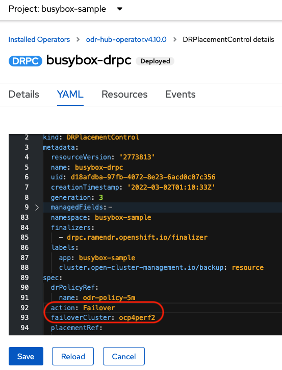
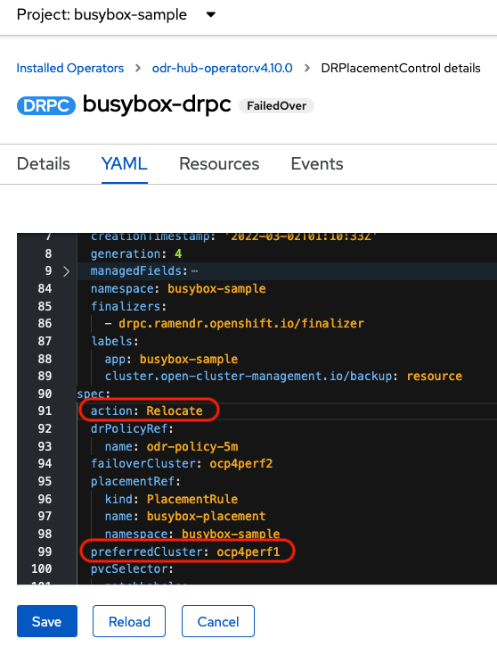

# OpenShift ACM 및 ODF를 사용한 OpenShift 클러스터의 Regional DR 구성
### ※ 현재 Tech Preview인 기능, OpenShift 4.10버전 기준으로 


#### OpenShift DR의 역할

- OpenShift 클러스터에서 애플리케이션과 그 상태를 보호
- 애플리케이션 및 해당 상태를 피어 클러스터로 장애 조치(이동)
- 애플리케이션 및 해당 상태를 이전에 배포된 클러스터로 재배치


### 요구 사항
- RHACM(Red Hat Advanced Cluster Management for Kubernetes) 서브스크립션
- RHODF(Red Hat OpenShift Data Foundation)의 Advanced 레벨 entitlement

- RHACM(Red Hat Advanced Cluster Management)은 여러 클러스터 및 애플리케이션 수명 주기를 관리하는 기능을 제공하여, 다중 클러스터 환경에서 컨트롤 플레인 역할을 합니다. RHACM은 허브(다른 클러스터들을 관리)와 매니지드 클러스터(허브에 의해 관리되는 클러스터) 두 부분으로 나뉩니다.
- ODF(OpenShift Data Foundation)은 OpenShift 클러스터에서 스테이트풀(Stateful) 애플리케이션을 위한 스토리지를 프로비저닝하고 관리하는 기능을 제공합니다.


OpenShift DR은 ACM와 ODF라는 두 가지 솔루션을 기반으로 OpenShift DR을 구성합니다. DR을 위해서는 추가적으로 아래와 같은 오퍼레이터가 배포됩니다.
- ODF 멀티클러스터 오케스트레이터 : RHACM 허브에 설치되며, DR을 위한 OpenShift Data Foundation 클러스터의 구성 및 피어링을 오케스트레이션합니다.
- OpenShift DR Hub Operator : DR을 적용할 애플리케이션의 장애 조치 또는 재배치를 조정하기 위해, 허브 클러스터에 ODF Multicluster Orchestrator 설치의 일부로 자동 설치됩니다.
- OpenShift DR Cluster Operator : 각 매니지드 클러스터에 자동으로 설치되어 애플리케이션의 모든 PVC 수명 주기를 관리합니다.


#### 전체적인 과정

1. 다른 클러스터들을 관리하는 허브 OpenShift 클러스터에 ACM 구성, **서로 겹치지 않는 CIDR**를 가진 매니지드 클러스터를 생성 또는 가져오기
2. 매니지드 클러스터에 ODF Operator 설치 및 스토리지 시스템 구성
3. 허브 클러스터에 ODF 멀티클러스터 오케스트레이터 설치
4. 허브 클러스터에서 두 매니지드 클러스터의 ODF 간 미러링 관계 생성
5. 두 매니지드 클러스터에 '미러링' 스토리지 클래스 리소스 생성
6. 각 매니지드 클러스터에서 Openshift DR Cluster Operator의 자동 설치 활성화 및 S3 시크릿 생성
7. 허브 클러스터에서 워크로드를 장애 조치, 재배치 하는 DRPolicy 리소스 생성
8. ACM 허브에서 샘플 애플리케이션을 배포한 후에 failover, 재배치 테스트


## 0. 클러스터 준비 (모두 OCP )

| 클러스터      | 필요 오퍼레이터                                       | ACM 인식 이름 | 버전 |
| ------------- | ----------------------------------------------------- | ------------- | ---- |
| 허브          | ACM, ODF Multicluster Orchestrator, (자동으로설치)DR Hub Operator   | local-cluster |      |
| 기본 매니지드 | ODF, (자동으로설치)Openshift DR Cluster Operator | cluster-1     | 4.9+ |
| 보조 매니지드 | ODF, (자동으로설치)Openshift DR Cluster Operator | cluster-2     | 4.9+ |

> 세 개의 클러스터는 서로 네트워크로 연결이 가능해야하고, 매니지드 클러스터들은 아래 예시와 같이 서로 클러스터 CIDR가 서로 겹치지 않아야 함

|           | clusterNetwork | serviceNetwork |
| --------- | -------------- | -------------- |
| 허브      | 10.128.0.0/14  | 172.30.0.0/16  |
| cluster-1 | 10.132.0.0/14  | 172.31.0.0/16  |
| cluster-2 | 10.136.0.0/14  | 172.32.0.0/16  |


### 매니지드 클러스터 사전 

- CIDR 겹치지 않게 설정

- 노드 당 최소 14 개의 CPU와 34GiB로 시작하는 것이 좋습니다.
- 3노드 합쳐서 최소 CPU 30 core와 RAM 72 GiB 사양 (10 core, 24 GiB X 3)을 권장합니다.


### 허브 클러스터 사전 준비
- 허브 클러스터에는 RHACM 오퍼레이터 설치 후, 기본 설정으로 `MultiClusterHub` CR 생성합니다.
필요한 경우 [RHACM 설치 가이드](https://access.redhat.com/documentation/en-us/red_hat_advanced_cluster_management_for_kubernetes/2.5/html-single/install/index)를 참조합니다.
- ACM 허브에서 cluster-1과 cluster-2를 직접 배포할 경우, 따로 import할 필요가 없습니다. 기존에 배포되어있는 클러스터를 cluster-1과 cluster-2로 사용할 경우, ACM 허브의 import 기능을 통해 클러스터 정보를 가져와야 합니다.
- ACM 허브에서 cluster-1과 cluster-2를 `Cluster set`으로 등록하고, `Submariner add-ons`을 설치해야합니다. 


### 클러스터 생성 후

작업의 용이성을 위해 각 클러스터 접속 정보에 대한 context를 생성합니다.
oc 커맨드를 통해 로그인 후, 각 접속 정보에 대한 context를 수정합니다.
혹은 아래 방법과 별도로 oc login alias를 만들어도 좋습니다.

```bash
$ oc login --token=sha256~ --server=https://api.hub-cluster.com:6443
$ oc config rename-context $(oc config current-context) hub
$ oc login --token=sha256~ --server=https://api.cluster-1.com:6443
$ oc config rename-context $(oc config current-context) c1
$ oc login --token=sha256~ --server=https://api.cluster-2.com:6443
$ oc config rename-context $(oc config current-context) c2
```


## 1. 매니지드 클러스터에 ODF 설치
매니지드 클러스터(cluster-1과 cluster-2)에 ODF 4.10 버전 이상의 오퍼레이터 설치 후, 기본 설정으로 스토리지 시스템 생성합니다.


## 2. 허브 클러스터에 Operator 설치

오퍼레이터 허브 통해 다음 오퍼레이터 설치합니다.
- ODF Multicluster Orchestrator
- OpenShift DR Hub Operator (ODF Multicluster Orchestrator 통해 자동으로 설치되지 않을 시 직접 설치)


## 3. 허브 클러스터에 미러 피어 생성

### 3-1. MirrorPeer 리소스 생성

ODF Multicluster Orchestrator 설치 후에 `MirrorPeer` 리소스를 생성할 수 있게 됩니다.
아래와 같이 허브 클러스터에서 mirror peer 리소스를 생성합니다.


```yaml
apiVersion: multicluster.odf.openshift.io/v1alpha1
kind: MirrorPeer
metadata:
  name: mirrorpeer-<cluster1>-<cluster2>
spec:
  items:
  - clusterName: <cluster1>
    storageClusterRef:
      name: ocs-storagecluster
      namespace: openshift-storage
  - clusterName: <cluster2>
    storageClusterRef:
      name: ocs-storagecluster
      namespace: openshift-storage
  manageS3: true
  schedulingIntervals:
  - 5m
  - 15m
```

`<cluster1>`과 `<cluster2>`에는 ACM 허브에 등록 되어있는 매니지드 클러스터의 이름을 대입합니다.
`schedulingIntervals`은 PV를 복제하는 시간 간격입니다. 위 예시의 경우, 5분 그리고 15분마다 PV를 복제합니다.


### 3-2. 매니지드 클러스터에서 Ceph mirroring 확인 

`MirrorPeer` 리소스를 생성하면 각 매니지드 클러스터에는 자동으로 `mirroring`이 활성화 됩니다.
각 매니지드 클러스터에서 Ceph block pool의  `mirroring`이 활성화 되었는지, `rbd-mirror` 파드가 실행되고 있는지, `daemon` 상태가 괜찮은지 확인합니다.

```bash
$ oc get cephblockpool -n openshift-storage -o=jsonpath='{.items[?(@.metadata.ownerReferences[*].kind=="StorageCluster")].spec.mirroring.enabled}{"\n"}'

$ oc get pods -o name -l app=rook-ceph-rbd-mirror -n openshift-storage

$ oc get cephblockpool ocs-storagecluster-cephblockpool -n openshift-storage -o jsonpath='{.status.mirroringStatus.summary}{"\n"}'
```

output:

```bash
$ true
$ pod/rook-ceph-rbd-mirror-a-6486c7d875-56v2v
$ {"daemon_health":"OK","health":"OK","image_health":"OK","states":{}
```


그리고 `mirror peer`의 각 `schedulingIntervals`에 대한 **`VolumeReplicationClass`** 가 각 매니지드 클러스터에서 생성되었는지 확인합니다. (interval이 5m, 15m일 경우 VolumeReplicationClass가 2개 생성됨)

```bash
$ oc get volumereplicationclass
```

Example output:

```none
NAME                                    PROVISIONER
rbd-volumereplicationclass-1625360775   openshift-storage.rbd.csi.ceph.com
rbd-volumereplicationclass-539797778    openshift-storage.rbd.csi.ceph.com
```


### 3-3. 오브젝트 버킷과 S3StoreProfiles 확인

각 매니지드 클러스터에서 새로운 **Object Bucket Claim**과 상응하는 오브젝트 버킷이 생성되었는지 확인합니다.

```bash
oc get obc,ob -n openshift-storage
```

Example output:

```none
NAME                                                       STORAGE-CLASS                 PHASE   AGE
objectbucketclaim.objectbucket.io/odrbucket-21eb5332f6b6   openshift-storage.noobaa.io   Bound   13m

NAME                                                                        STORAGE-CLASS                 CLAIM-NAMESPACE   CLAIM-NAME   RECLAIM-POLICY   PHASE   AGE
objectbucket.objectbucket.io/obc-openshift-storage-odrbucket-21eb5332f6b6   openshift-storage.noobaa.io                                  Delete         Bound   13m
```


허브 클러스터의 ConfigMap `ramen-hub-operator-config`의 `s3StoreProfiles` 섹션에 `openshift-dr-system`의 새로운 시크릿이 삽입되어있는지 확인합니다.
cluster-1과 cluster2에 대한 시크릿이 각각 들어가 있어야 하므로, 시크릿이 2개 모두 삽입되어있는지 살펴보아야 합니다.
아래와 같은 출력값이 나타나지 않는다면 다음 과정이 작동하지 않습니다.

```bash
$ oc get secrets -n openshift-dr-system | grep Opaque
$ oc get cm ramen-hub-operator-config -n openshift-dr-system -o yaml | grep -A 14 s3StoreProfiles
```

Example output:

```none
8b3fb9ed90f66808d988c7edfa76eba35647092   Opaque		2      16m
af5f82f21f8f77faf3de2553e223b535002e480   Opaque		2      16m
```

```yaml
s3StoreProfiles:
- s3Bucket: odrbucket-21eb5332f6b6
  s3CompatibleEndpoint: https://s3-openshift-storage.apps.perf2.example.com
  s3ProfileName: s3profile-ocp4perf2-ocs-storagecluster
  s3Region: noobaa
  s3SecretRef:
    name: 8b3fb9ed90f66808d988c7edfa76eba35647092
    namespace: openshift-dr-system
- s3Bucket: odrbucket-21eb5332f6b6
  s3CompatibleEndpoint: https://s3-openshift-storage.apps.perf1.example.com
  s3ProfileName: s3profile-ocp4perf1-ocs-storagecluster
  s3Region: noobaa
  s3SecretRef:
    name: af5f82f21f8f77faf3de2553e223b535002e480
    namespace: openshift-dr-system
```


## 4. 미러링 스토리지클래스 생성

각 매니지드 클러스터 간의 빠른 이미지 복제를 위해 필요한 추가 `imageFeatures`(*exclusive-lock*, *object-map*, *fast-diff*)를 가진 새로운 **StorageClass**를 생성하고, 이 클래스를 사용해서 미러링이 활성화 된 블록 볼륨을 생성해야 합니다.

> 각 매니지드 클러스터에 아래와 같은 스토리지 클래스를 생성합니다.

```yaml
allowVolumeExpansion: true
apiVersion: storage.k8s.io/v1
kind: StorageClass
metadata:
  name: ocs-storagecluster-ceph-rbdmirror
parameters:
  clusterID: openshift-storage
  csi.storage.k8s.io/controller-expand-secret-name: rook-csi-rbd-provisioner
  csi.storage.k8s.io/controller-expand-secret-namespace: openshift-storage
  csi.storage.k8s.io/fstype: ext4
  csi.storage.k8s.io/node-stage-secret-name: rook-csi-rbd-node
  csi.storage.k8s.io/node-stage-secret-namespace: openshift-storage
  csi.storage.k8s.io/provisioner-secret-name: rook-csi-rbd-provisioner
  csi.storage.k8s.io/provisioner-secret-namespace: openshift-storage
  imageFeatures: layering,exclusive-lock,object-map,fast-diff
  imageFormat: "2"
  pool: ocs-storagecluster-cephblockpool
provisioner: openshift-storage.rbd.csi.ceph.com
reclaimPolicy: Delete
volumeBindingMode: Immediate
```


**각 매니지드 클러스터에서 새로운 스토리지 클래스가 잘 만들어졌는지 확인합니다.**

```bash
$ oc config use-context c1
$ oc get storageclass | grep rbdmirror | awk '{print $1}'
$ oc config use-context c2
$ oc get storageclass | grep rbdmirror | awk '{print $1}'
```

Example output:

```none
ocs-storagecluster-ceph-rbdmirror
```


## 5. S3 엔드포인트 간 SSL 접속 설정

1. 기본 매니지드 클러스터에 대한 인그레스 인증서를 추출하고 `primary.crt`로 출력

   ```bash
   $ oc config use-context c1
   $ oc get cm default-ingress-cert -n openshift-config-managed -o jsonpath="{['data']['ca-bundle\.crt']}" > primary.crt
   ```

2. 보조 매니지드 클러스터에 대한 인그레스 인증서를 추출하고 `secondary.crt`로 출력

   ```bash
   $ oc config use-context c2
   $ oc get cm default-ingress-cert -n openshift-config-managed -o jsonpath="{['data']['ca-bundle\.crt']}" > secondary.crt
   ```

3. **기본 매니지드 클러스터** , **보조 매니지드 클러스터** 및 **허브 클러스터**에 `cm-clusters-crt.yaml`라는 파일 이름으로 원격 클러스터의 인증서 번들을 보유할 새 **ConfigMap** 을 작성

   ```bash
   $ cat << EOF >> cm-clusters-crt.yaml
   apiVersion: v1
   kind: ConfigMap
   metadata:
     name: user-ca-bundle
     namespace: openshift-config
   data:
     ca-bundle.crt: |
   EOF
   ```

   ```bash
   cat primary.crt >> cm-clusters-crt.yaml
   cat secondary.crt >> cm-clusters-crt.yaml
   ```

   ```bash
   vim cm-clusters-crt.yaml
   ```

   (1) `ctrl` + `v` 로 비주얼 모드 진입 후 화살표로 블록 설정

   (2) 그다음 `:` 눌러서 `'<'>` 나오면 `norm i` 입력후 i 옆에 띄어쓰기 4번 후 `enter`

   > crt 파일의 인증서가 configmap에 잘 들어갔는지 확인하기

4. 각 클러스터에 configmap 생성

   ```bash
   oc config use-context hub
   oc create -f cm-clusters-crt.yaml
   oc config use-context c1
   oc create -f cm-clusters-crt.yaml
   oc config use-context c2
   oc create -f cm-clusters-crt.yaml
   ```

5. default proxy를 패치

   ```bash
   oc config use-context hub
   oc patch proxy cluster --type=merge  --patch='{"spec":{"trustedCA":{"name":"user-ca-bundle"}}}'
   oc config use-context c1
   oc patch proxy cluster --type=merge  --patch='{"spec":{"trustedCA":{"name":"user-ca-bundle"}}}'
   oc config use-context c2
   oc patch proxy cluster --type=merge  --patch='{"spec":{"trustedCA":{"name":"user-ca-bundle"}}}'
   ```

   

## 6. 허브 클러스터에서 Disaster Recovery Policy 생성

OpenShift DR은 RHACM 허브 클러스터에서 DRPolicy(재해 복구 정책) 리소스(클러스터 범위)를 사용하여 관리되는 클러스터에서 워크로드를 배포, 장애 조치 및 재배치합니다.

1. `openshift-dr-system` 프로젝트에서 DR 정책 생성

   ```yaml
   apiVersion: ramendr.openshift.io/v1alpha1
   kind: DRPolicy
   metadata:
     name: odr-policy-5m
   spec:
     drClusterSet:
     - name: <cluster1>
       region: <string_value_1>
       s3ProfileName: s3profile-<cluster1>-ocs-storagecluster
     - name: <cluster2>
       region: <string_value_2>
       s3ProfileName: s3profile-<cluster2>-ocs-storagecluster
     schedulingInterval: 5m
   ```

위와 같은 정책을 수정해서 아래와 같은 `drpolicy.yaml` 로 생성합니다. <cluster1>과 같은 클러스터 이름은 ACM 허브에 등록된 이름으로 입력하고, <string_value_1> 값은 임의로 입력해도 괜찮습니다.

   ```yaml
   apiVersion: ramendr.openshift.io/v1alpha1
   kind: DRPolicy
   metadata:
     name: odr-policy-5m
   spec:
     drClusterSet:
       - name: cluster-1
         region: region1
         s3ProfileName: s3profile-cluster-1-ocs-storagecluster
       - name: cluster-2
         region: region2
         s3ProfileName: s3profile-cluster-2-ocs-storagecluster
     schedulingInterval: 5m
   ```

   > schedulingInterval은 MirrorPeer에 설정한 값 중 하나여야 함(for example: 5m)
   > MirrorPeer에 설정한 다른 schedulingIntervals로 볼륨 복제를 하고 싶다면 해당 interval 값으로 DR 정책을 추가로 생성해주어야 함.

   

## 7. OpenShift DR cluster operator 자동 설치 활성화

DRPolicy가 성공적으로 생성되고 나면,  기본 매니지드 클러스터 및 보조 매니지드 클러스터에 `OpenShift DR Cluster operator`를 설치할 수 있습니다.

1. 허브 클러스터의 `ramen-hub-operator-config`를 수정해서 `deploymentAutomationEnabled: true`를 추가합니다.

   ```bash
   $ oc edit configmap ramen-hub-operator-config -n openshift-dr-system
   ```

   ```
   deploymentAutomationEnabled: true
   ```

   ```yaml
   apiVersion: v1
   data:
     ramen_manager_config.yaml: |
       apiVersion: ramendr.openshift.io/v1alpha1
       drClusterOperator:
         deploymentAutomationEnabled: true  ## <-- Add to enable installation of ODR Cluster operator on managed clusters
         catalogSourceName: redhat-operators
         catalogSourceNamespaceName: openshift-marketplace
         channelName: stable-4.10
         clusterServiceVersionName: odr-cluster-operator.v4.10.0
         namespaceName: openshift-dr-system
         packageName: odr-cluster-operator
   [...]
   ```

2. 오퍼레이터 허브 또는 아래 커맨드를 통해 **각 매니지드 클러스터**에서 OpenShift DR Cluster Operator가 성공적으로 설치된 것을 확인합니다.

   ```bash
   $ oc get csv,pod -n openshift-dr-system
   ```


## 8. 매니지드 클러스터에서 S3 시크릿 생성

Multicloud Object Gateway 버킷 암호는 생성 시 **Hub 클러스터**의 `MirrorPeer` 에 생성 및 저장됩니다. 이 정보를 매니지드 클러스터에 시크릿으로 생성해줍니다.

1. 허브 클러스터에서 오브젝트 버킷 시크릿을 확인합니다.

   ```bash
   $ oc config use-context hub
   $ oc get secrets -n openshift-dr-system -l multicluster.odf.openshift.io/created-by=mirrorpeersecret | grep Opaque | awk '{print $1}'
   ```

   Example output:

   ```none
   8b3fb9ed90f66808d988c7edfa76eba35647092   Opaque
   af5f82f21f8f77faf3de2553e223b535002e480   Opaque
   ```

2. 시크릿을 추출합니다.

   ```bash
   $ oc get secrets <<secret-1>> -n openshift-dr-system -o yaml > odr-s3-secret1.yaml
   $ oc get secrets <<secret-2>> -n openshift-dr-system -o yaml > odr-s3-secret2.yaml
   ```

3. 허브에서 추출한 시크릿을 각 매니지드 클러스터에서 생성합니다.

   ```bash
   oc config use-context c1
   oc create -f odr-s3-secret1.yaml -n openshift-dr-system
   oc create -f odr-s3-secret2.yaml -n openshift-dr-system
   oc config use-context c2
   oc create -f odr-s3-secret1.yaml -n openshift-dr-system
   oc create -f odr-s3-secret2.yaml -n openshift-dr-system
   ```


## 9. 샘플 애플리케이션 생성

기본 매니지드 클러스터 <--> 보조 매니지드 클러스터 간 failover를 테스트하기 위해 `busybox`라는 샘플 앱을 생성합니다.

### 9-1. **DRPlacementControl** 리소스 생성

허브 클러스터에서 새로운 프로젝트를 생성합니다.

```bash
oc config use-context hub
oc new-project busybox-sample
```


**DRPlacementControl** 리소스를 생성합니다.

DRPlacementControl은 OpenShift DR Hub Operator가 Hub 클러스터에 설치된 후에 사용할 수 있는 API입니다. DRPolicy에 포함된 클러스터 간에 데이터 가용성을 기반으로 배치하는 것은 Advanced Cluster Manager PlacementRule 조정자 입니다. 

1. 허브 클러스터에서 `busybox-sample` 프로젝트의 `설치된 Operator`로 이동하고 **OpenShift DR Hub Operator** 를 클릭합니다. 사용 가능한 두 API, DRPolicy 및 DRPplacementControl 이 표시되어야 합니다.

2. `busybox-sample` 프로젝트가 선택 되어있는지 확인합니다.

3. 아래 YAML에서 `preferredCluster` 를 ACM의 매니지드 클러스터 이름으로 설정하고, 
   `drPolicyRef`에는 원하는 복제 간격이 있는 **DRPolicy**의 이름을 넣습니다.

   ```none
   apiVersion: ramendr.openshift.io/v1alpha1
   kind: DRPlacementControl
   metadata:
     labels:
       app: busybox-sample
     name: busybox-drpc
   spec:
     drPolicyRef:
       name: odr-policy-5m     ## <-- Modify to specify desired DRPolicy and RPO
     placementRef:
       kind: PlacementRule
       name: busybox-placement
     preferredCluster: cluster-1
     pvcSelector:
       matchLabels:
         appname: busybox
   ```

4. DRPC를 생성합니다.

   ```none
   $ oc create -f busybox-drpc.yaml -n busybox-sample
   ```

   > 중요! 이 리소스는 `busybox-sample` 네임스페이스(또는 이전에 생성한 네임스페이스)에서 생성해야 합니다.

   

### 9-2. PlacementRule 생성

리소스 템플릿을 배포할 수 있는 대상 클러스터를 정의하는 **PlacementRule** 리소스를 만듭니다 . 배치 규칙을 사용하여 애플리케이션의 멀티클러스터 배포를 용이하게 합니다.

1. `busybox-sample` 애플리케이션에 대한 배치 규칙 리소스를 생성합니다

   ```none
   apiVersion: apps.open-cluster-management.io/v1
   kind: PlacementRule
   metadata:
     labels:
       app: busybox-sample
     name: busybox-placement
   spec:
     clusterConditions:
     - status: "True"
       type: ManagedClusterConditionAvailable
     clusterReplicas: 1
     schedulerName: ramen
   ```

   ```none
   $ oc create -f busybox-placementrule.yaml -n busybox-sample
   ```

   > 중요! 이 리소스는 `busybox-sample` 네임스페이스(또는 이전에 생성한 네임스페이스)에서 생성해야 합니다.


### 9-3. RHACM 콘솔을 사용하여 **샘플 애플리케이션** 생성

1. 허브 클러스터의 ACM 화면에서 **애플리케이션** 선택, **subscription** 유형으로 생성 선택

2. 애플리케이션 **이름** (예: `busybox`) 및 **네임스페이스** (예: `busybox-sample`)를 입력합니다.

3. 리소스의 리포지토리 위치 섹션에서 **리포지토리 유형**을  `Git` 으로 선택합니다 .

4. 샘플 애플리케이션의 Git 리포지토리 URL , 리소스 Pod 및 PVC가 생성될 github **분기** 및 **경로**를 입력합니다.

   > GitLab 주소 확인

   ```
   http://git.ocp-vm.poc.cloud/gitlab-instance-000000/poc-acm
   ```

   Branch: `main`
   Path: `ocm-ramen-samples`

5. 애플리케이션 생성 전에  `ocs-storagecluster-ceph-rbdmirror` 스토리지 클래스가 생성되었는지 확인합니다.

   ```bash
   $ oc config use-context c1
   $ oc get storageclass | grep rbdmirror | awk '{print $1}'
   $ oc config use-context c2
   $ oc get storageclass | grep rbdmirror | awk '{print $1}'
   ```

6. **배포할 클러스터** 선택 --> **Select an existing placement configuration --> `busybox-placement` 선택

7. Create로 생성

8. 샘플 애플리케이션의 원하는 클러스터에 잘 배포되었는지, 배포 및 복제 상태를 확인합니다.

   ```bash
   $ oc config use-context c1
   $ oc get pods,pvc -n busybox-sample
   ```

   Example output:

   ```none
   NAME          READY   STATUS    RESTARTS   AGE
   pod/busybox   1/1     Running   0          6m
   
   NAME                                STATUS   VOLUME                                     CAPACITY   ACCESS MODES   STORAGECLASS                  AGE
   persistentvolumeclaim/busybox-pvc   Bound    pvc-a56c138a-a1a9-4465-927f-af
   ```

   

   **PVC에 대한 복제 리소스**도 생성 되었는지 확인합니다.

   ```bash
   $ oc get volumereplication,volumereplicationgroup -n busybox-sample
   ```

   Example output:

   ```none
   NAME                                                             AGE   VOLUMEREPLICATIONCLASS           PVCNAME       DESIREDSTATE   CURRENTSTATE
   volumereplication.replication.storage.openshift.io/busybox-pvc   6m   odf-rbd-volumereplicationclass   busybox-pvc   primary        Primary
   
   NAME                                                       AGE
   volumereplicationgroup.ramendr.openshift.io/busybox-drpc   6m
   ```

   

   **기본 매니지드 클러스터** 와 **보조 매니지드 클러스터** 모두에서 다음 명령어를 실행하여 `busybox` 볼륨이 대체 클러스터에 복제 되었는지 확인 합니다. `"states":{"replaying":2}`를 출력해야 합니다.

   ```bash
   $ oc get cephblockpool ocs-storagecluster-cephblockpool -n openshift-storage -o jsonpath='{.status.mirroringStatus.summary}{"\n"}'
   ```

   Example output:

   ```none
   {"daemon_health":"OK","health":"OK","image_health":"OK","states":{"replaying":2}}
   ```

   > 중요! 
   >
   > 두 개의 매니지드 클러스터에서 모두 동일하게 `"states":{"replaying":2}` 상태를 출력해야 합니다.
   >
   > daemon_health가  WARNING에서 healthy로 이동하는 데 최대 10분이 소요될 수 있습니다 . 상태가 결국 OK가 되지 않으면 ACM 콘솔을 사용하여 Submariner add-ons의 연결이 여전히 정상 상태인지 확인합니다. 

   

## 10. 매니지드 클러스터 간의 애플리케이션 장애 조치(FailOver)

Regional-DR의 장애 조치 방법은 애플리케이션 기반입니다. 

이러한 방식으로 보호할 각 애플리케이션에는 애플리케이션의 네임스페이스에 생성된 `DRPlacementControl` 리소스와 `PlacementRule` 리소스가 있어야 합니다.

1. Hub 클러스터에서 Installed Operators로 이동한 다음 **Openshift DR Hub Operator** 를 클릭 합니다.

2. **DRPlacementControl** 탭에서 DRPC  `busybox-drpc`를 클릭한 다음 YAML 보기를 클릭합니다.

3. 아래 스크린샷과 같이 `action` 및 `failoverCluster`세부 정보를 추가합니다. `failoverCluster`는 보조 매니지드 클러스터의 ACM 클러스터 이름이어야 하고, action 값은 대/소문자를 구분해야합니다.

   

   ```yaml
     action: Failover
     failoverCluster: cluster-2
   ```

   **저장**을 클릭 합니다.

4. `busybox` 애플리케이션이 현재 YAML 파일에 지정된 Failover 클러스터인 보조 매니지드 클러스터에서 실행 중인지 확인하십시오.

   ```bash
   $ oc config use-context c2
   $ oc get pods,pvc -n busybox-sample
   ```

   출력 예:

   ```none
   NAME          READY   STATUS    RESTARTS   AGE
   pod/busybox   1/1     Running   0          35s
   
   NAME                                STATUS   VOLUME                                     CAPACITY   ACCESS MODES   STORAGECLASS                  AGE
   persistentvolumeclaim/busybox-pvc   Bound    pvc-79f2a74d-6e2c-48fb-9ed9-666b74cfa1bb   5Gi        RWO            ocs-storagecluster-ceph-rbd   35s
   ```

5. `busybox` 앱이 기본 매니지드 클러스터에서 더 이상 실행되고 있지 않은지도 확인 합니다.

   ```bash
   $ oc config use-context c1
   $ oc get pods,pvc -n busybox-sample
   ```

   출력 예:

   ```none
   No resources found in busybox-sample namespace.
   ```


## 11. 매니지드 클러스터 간의 애플리케이션 재배치

1. Hub 클러스터에서 Installed Operators로 이동한 다음 **Openshift DR Hub Operator** 를 클릭 합니다.

2. **DRPlacementControl** 탭에서 DRPC  `busybox-drpc`를 클릭한 다음 YAML 보기를 클릭합니다.

3. **action**을 `Relocate` 로 수정 

   

   ```
     action: Relocate
   ```

   **저장**을 클릭 합니다.

4. 애플리케이션 `busybox`가 현재 기본 매니지드 클러스터에서 실행 중인지 확인하십시오. FailBack은 Failover 작업 전에 애플리케이션이 실행되었던 위치인 YAML 파일에 지정된 **preferredCluster**로 진행됩니다.

   ```bash
   $ oc config use-context c1
   $ oc get pods,pvc -n busybox-sample
   ```

   출력 예:

   ```none
   NAME          READY   STATUS    RESTARTS   AGE
   pod/busybox   1/1     Running   0          60s
   
   NAME                                STATUS   VOLUME                                     CAPACITY   ACCESS MODES   STORAGECLASS                  AGE
   persistentvolumeclaim/busybox-pvc   Bound    pvc-79f2a74d-6e2c-48fb-9ed9-666b74cfa1bb   5Gi        RWO            ocs-storagecluster-ceph-rbd   61s
   ```

5. `busybox`가 보조 매니지드 클러스터에서 실행 중인지 확인 합니다. 이 매니지드 클러스터에서 busybox 애플리케이션을 더 이상 실행하지 않아야 합니다.

   ```bash
   $ oc config use-context c2
   $ oc get pods,pvc -n busybox-sample
   ```

   출력 예:

   ```none
   No resources found in busybox-sample namespace.
   ```


## 12. 테스트 완료 후 샘플 애플리케이션 삭제

1. RHACM 허브 콘솔에서 애플리케이션을 삭제합니다. 이때 관련 리소스도 삭제 옵션을 통해 함께 삭제합니다.
2. RHACM 콘솔을 사용하여  `busybox` 애플리케이션을 삭제한 후에  `DRPlacementControl`도 즉시 삭제해야 합니다.


